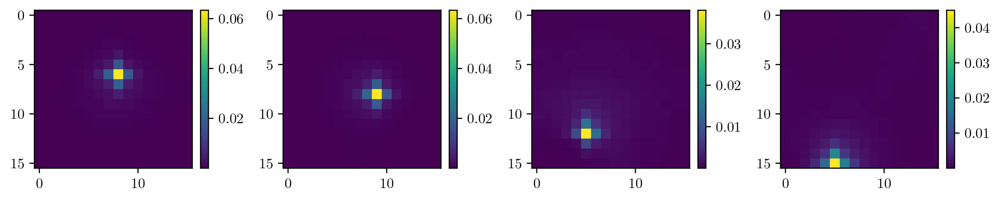
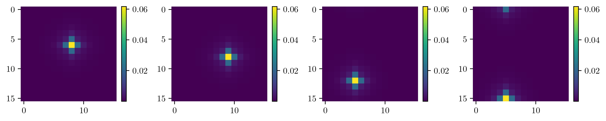
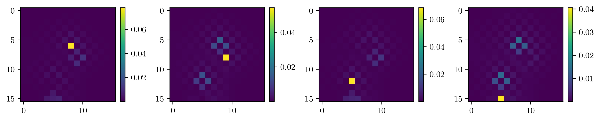
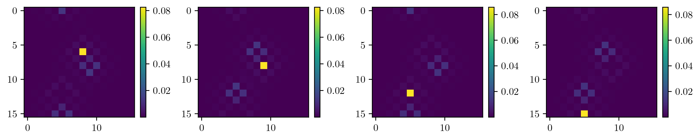

# Quantum-walk search in Motion (https://arxiv.org/abs/2310.14345)

This repository contains code related to the work presented in the paper titled 'Quantum Walk Search in Motion.' The code provides implementations, data, and tools used in the research project described in the paper.

## Paper Citation
If you use this code in your work, please cite our paper:

## Usage

The uses of code are straightforward and only need to run the full Python scripts for different algorithms discussed in the article. The essential libraries such as numpy, scipy and matplotlib are used. 

## Description

* Essential_Function.py : This contains a few useful functions, such as vector norm, complex conjugation, etc., that will used throughout the notebook.
* QWSA.py : This contains code for quantum-walk-based search algorithms for open and closed two-dimensional grids. 

* QWSA_Multipoint.py : We extend the algorithm with the proposed method in the paper for a multiple-point search algorithm that reveals the marked points and their order. 

Fig. (a) : Probability distribution at $t_\text{op}$ step for different layers with a single marked point in each layer found using quantum-search algorithm single-layer amplification Top: Open boundary condition Bottom: Periodic boundary condition

Fig. (b) : Probability distribution at $t_\text{op}$ step for different layers with a single marked point in each layer found using quantum-search algorithm multi-layer amplification Top: Open boundary condition Bottom: Periodic boundary condition.

* Tracking.py : We use the formulation to propose the algorithm for particle tracking. The .gif or .mp4 file shows the results clearly showing the trajectory of the particle as it passes through different layers.

Fig. (c): Probability distribution with time steps in tracking problem

## Contact
For questions or further information, don't hesitate to get in touch with Himanshu Sahu at [himanshusah1@iisc.ac.in].
